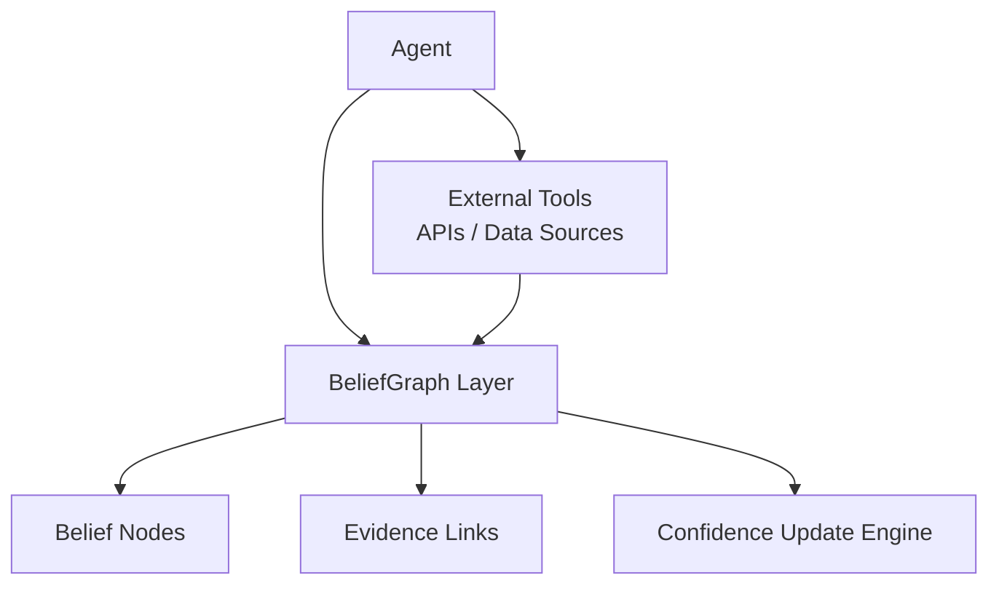

# BeliefGraph


BeliefGraph is an open framework for persistent reasoning in AI agents.

Most AI agents today are stateless. Each interaction starts fresh or relies on vector retrieval. This makes it difficult for agents to maintain long-term beliefs, track assumptions, or update conclusions as new evidence appears.

BeliefGraph introduces a structured layer that allows agents to maintain explicit belief networks.

These networks represent:

beliefs  
evidence  
confidence levels  
relationships between claims  

Agents update these graphs over time as new information arrives.

---

## Core Idea

Instead of storing knowledge only in embeddings or prompts, agents maintain a structured belief graph.

Each belief contains:

- a statement
- a confidence score
- supporting evidence
- relationships to other beliefs

---

## Architecture



---

## Example Belief Node

```json
{
  "belief": "interest_rates_increase_affects_mortgage_affordability",
  "confidence": 0.82,
  "evidence_sources": ["market_data", "historical_trends"]
}
```
## Running the Prototype

Clone the repository and run the demo:

```bash
python examples/demo.py
```

The script demonstrates:

- creating a belief
- adding evidence
- updating confidence using a Bayesian rule

## Belief Propagation

Beliefs in the graph can influence other beliefs through weighted relationships.

Example:

interest_rates_increase → mortgage_affordability_declines

When confidence in the first belief increases, the second belief updates automatically.

This is implemented through the propagation engine.

Run the demo:

```bash
python examples/demo.py
```

## Contradiction Relationships

Beliefs can also contradict other beliefs.

Example relationships:

interest_rates_increase → mortgage_affordability_declines (support)

interest_rates_increase → housing_demand_strong (contradict)

Support edges increase confidence in the target belief.  
Contradiction edges decrease confidence in the target belief.

Run the demo:

```bash
python examples/demo.py
```

---

## Roadmap

Phase 1  
Belief node schema

Phase 2  
Graph update engine

Phase 3  
Agent reasoning queries

Phase 4  
Multi-agent belief sharing
